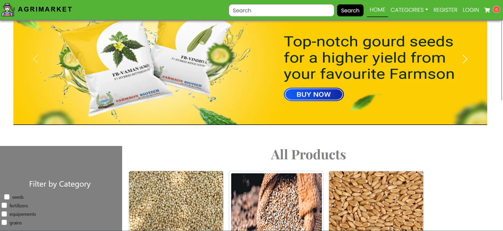
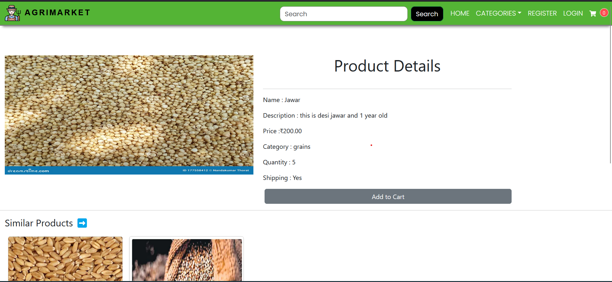
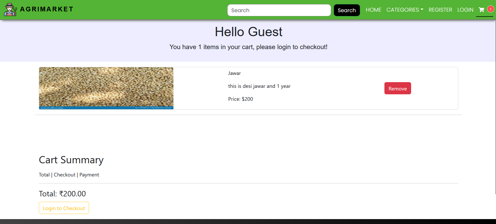
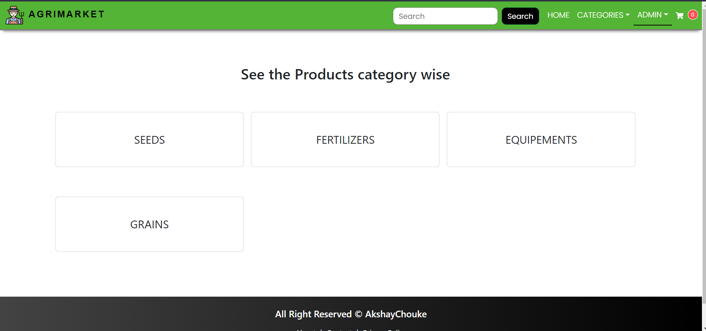

<h2>Welcome to AgriMarket</h2>
<h3>Note - As this is deployed on free hosting service render so you might face slow service so please wait until it is loaded totally</h3>

Welcome to AgriMarket, your one-stop destination for all your agricultural needs! Our innovative ecommerce platform is specifically designed to cater to farmers, providing them with a convenient and efficient way to buy and sell old farming equipment and accessories, such as fertilizers and more.

At AgriMarket, we understand the importance of modernizing agricultural practices while also honoring traditional methods. With our user-friendly interface, farmers can easily list their old or surplus farming equipment for sale. Whether it's tractors, plows, harvesters, irrigation systems, or other machinery, farmers can find a wide range of options to choose from.

On the other hand, if you're looking to upgrade your farming setup or expand your agricultural operations, AgriMarket offers an extensive collection of high-quality farming equipment and accessories. Our curated selection includes top-notch fertilizers, seeds, pesticides, and other essential items that can enhance your crop yields and overall farm productivity.

Why choose AgriMarket? We have taken every measure to ensure that the buying and selling experience on our platform is seamless and secure. Our transparent pricing system allows farmers to get the best value for their old equipment while enabling buyers to find competitive deals. Additionally, our platform is designed to foster a sense of community, where farmers can connect with each other, exchange knowledge, and share valuable insights for better farming practices.

Join AgriMarket today and experience a revolutionary way to buy and sell old farming equipment and essential accessories. Whether you're a seasoned farmer or just starting in the industry, we are committed to supporting your agricultural journey every step of the way. Together, let's grow a greener, more prosperous future for agriculture!

